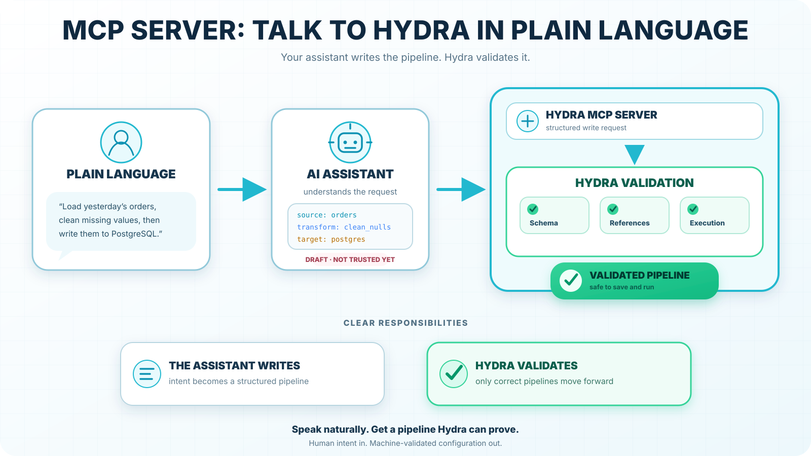
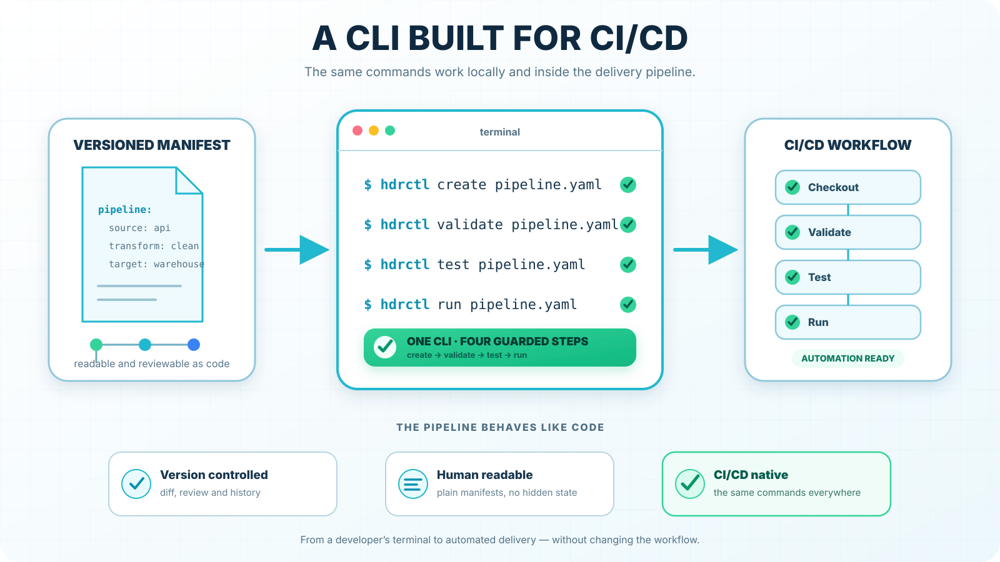
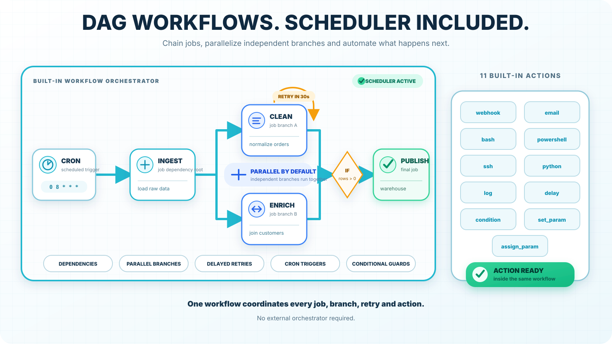
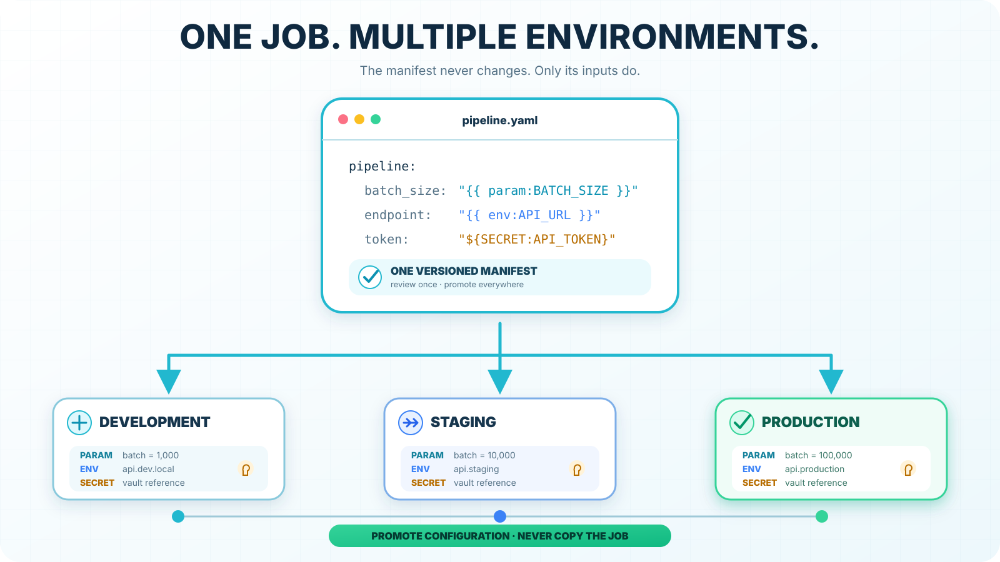
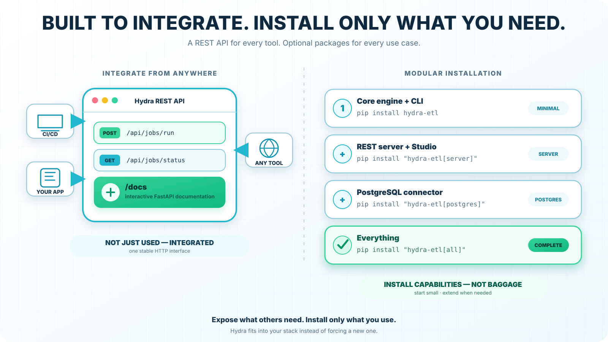
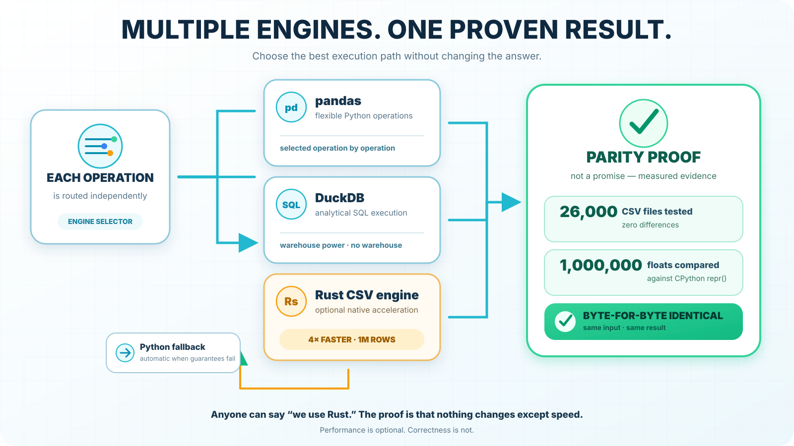
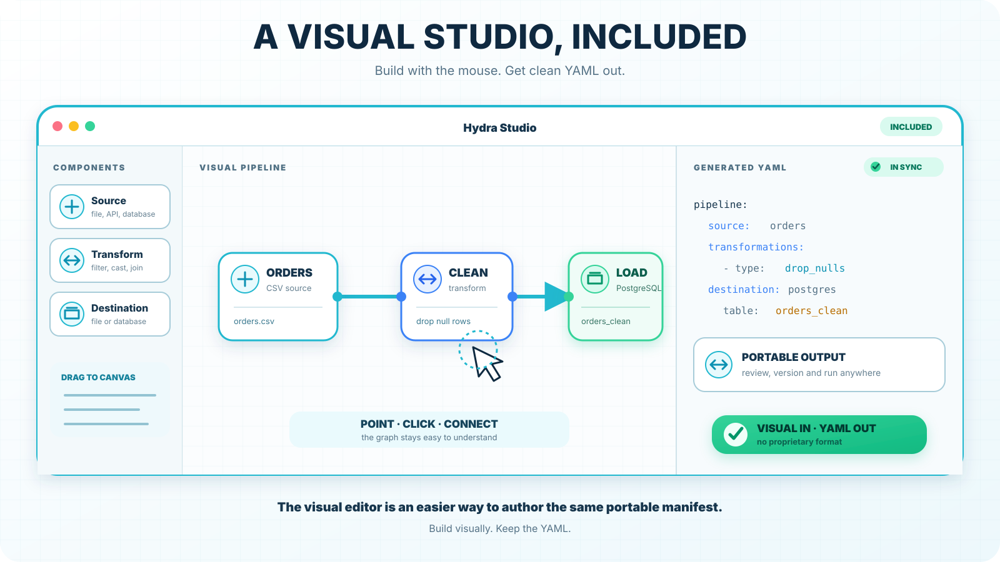
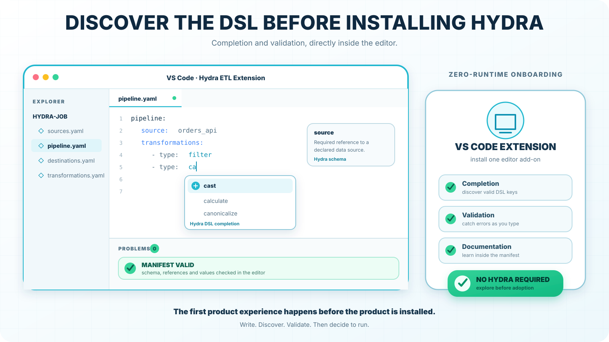

### MCP server: talk to Hydra in plain language.

Your assistant writes the pipelines; Hydra validates them.



### The combination of declarative, visual, and nothing to deploy.

Taken separately, none of the three is unique. Together, they are: Airbyte's interface requires a deployment, Talend is dead, Apache Hop and Pentaho require a JVM, and NiFi is heavy. You are alone on this combination.


### Validation before execution is your only truly isolated advantage.

dbt catches reference errors at compile time, but no file-and-database pipeline tool can answer deterministically, “Will this run?” before touching any data. It can be demonstrated with a single command, and nobody can copy it without rebuilding their architecture.


### A CLI built for CI/CD — hdrctl creates, validates, tests, and runs from a terminal or an integration pipeline.

Manifests are versioned and reviewed like code.



### Hydra includes its own scheduler.

DAG workflows provide dependencies, automatic parallel execution of independent branches, delayed retries, cron triggers, conditional guards, and eleven actions including webhook, email, Bash, PowerShell, SSH, and Python.

Chain multiple jobs with dependencies, parallel execution of independent branches, retries, cron triggers, and conditional guards.



### One job, multiple environments.

{{ param: }}, {{ env: }}, ${SECRET:}: the manifest does not change between development, staging, and production — only the parameters change. It is the natural extension of the DevOps argument.



### Hydra exposes a REST API.

FastAPI provides interactive documentation at /docs. Hydra can be controlled from your CI pipeline, your application, or any tool — it is not merely used, it integrates.

Modular installation.

Install only what you use: the engine alone, with the server, with PostgreSQL, or everything.



### Two execution engines, selected per operation.

pandas or DuckDB, case by case. The power of analytical SQL without a data warehouse.

In addition: a Rust engine for large files.

Optional native acceleration: CSV reading four times faster on one million rows, byte-for-byte identical results, and automatic fallback to Python whenever the guarantee cannot be maintained.

But here you have something almost nobody else possesses: parity proof. 26,000 CSV files tested with zero differences; one million floats compared against CPython repr(). Anyone can say, “We use Rust.” Almost nobody proves that the result is identical.



### A visual Studio is included.

Build the pipeline with the mouse and get YAML out.



### VS Code extension — manifest completion and validation directly inside the editor, without installing Hydra.

Discover the DSL before even trying the product.



---

# Hydra ETL

[](https://pypi.org/project/hydra-etl/)
[](https://pypi.org/project/hydra-etl/)
[](LICENSE)
[](#project-status)

**Your data pipelines are described, not programmed.**

Hydra is a declarative ETL engine: you write what the pipeline *is* in YAML, and
Hydra decides how to run it. The same manifests run from the terminal, from a
REST API, or from a browser canvas — one engine underneath, and one
`pip install` to get all three.

```bash
pip install "hydra-etl[server]"
hdrctl serve
```

Open **http://localhost:5678** — that is Hydra Studio. No Node, no build step,
no database, no broker, nothing else to start.

<!-- TODO: insert Studio screenshot or GIF here (docs/assets/studio.png) -->

---

## Project status

**Beta.** The connectors and steps documented below are implemented and
covered by tests. The shape of the YAML DSL is settled; any breaking change to
it will be announced in the release notes before 1.0. Use it on real work,
pin your version.

---

## What you get

|               |                                                                          |
| ------------- | ------------------------------------------------------------------------ |
| **Engine**    | Declarative jobs: one source, N transformations, one destination         |
| **CLI**       | `hdrctl` — scaffold, validate, run, inspect. English and Spanish         |
| **API**       | FastAPI, with interactive docs at `/docs`                                |
| **Studio**    | Visual editor for jobs and workflows, served by the same process         |
| **Workflows** | Multi-job DAG with dependencies, actions, retries and runtime parameters |

Connectors: **CSV, JSON, Parquet, MySQL/MariaDB, PostgreSQL, MongoDB, Web API**.
Transformation engines: **Pandas** and **DuckDB**.

---

## What Hydra is, and what it is not

**Hydra is**

- a **declarative** ETL engine — the pipeline is data, not code, so it can be
  read, diffed, reviewed and generated;
- **self-contained** — one Python package, no cluster, no message broker, no
  metadata database to install;
- **single-node** — built for files and operational databases, from a laptop to
  one server, with an optional Rust path when volume grows.

**Hydra is not**

- a *distributed compute engine* — if your data does not fit on one machine,
  you want Spark;
- a *platform orchestrator* — Hydra sequences its own jobs, but it does not
  manage a scheduler fleet, backfills or SLAs the way Airflow, Dagster or
  Prefect do;
- a *warehouse transformation framework* — if your data is already in
  Snowflake or BigQuery and you only transform it there, you want dbt;
- a *BI or charting tool* — Hydra moves and reshapes data, it does not
  visualise it.

## Who it is for

- **Data engineers and analysts** who need repeatable file-and-database
  pipelines without standing up infrastructure for them.
- **Teams where the pipeline must stay readable** by someone who does not write
  Python — a YAML manifest reviewed in a pull request, not a script.
- **Developers embedding ETL in a product**, who want a CLI and a REST API over
  the same engine.

---

## A job in four files

A job is a folder. Four manifests describe it, and each one answers a single
question.

**`sources.yaml`** — where the data comes from

```yaml
version: "1.0"
sources:
  src_input:
    type: csv
    extract:
      table: ./input.csv
```

**`transformations.yaml`** — how it is reshaped

```yaml
version: "1.0"
steps:
  - cast:
      mapping:
        amount: float
  - filter:
      expr: "amount > 0"
  - aggregate:
      by: [name]
      agg:
        total: { func: sum, col: amount }
```

A CSV carries no types, so `cast` comes before any numeric comparison.

**`destinations.yaml`** — where it goes

```yaml
version: "1.0"
destinations:
  dest_output:
    type: csv
    load:
      table: ./output.csv
      mode: replace          # append | replace | upsert
```

**`pipeline.yaml`** — which source feeds which destination

```yaml
version: "1.0"
pipeline:
  from: src_input
  to: dest_output
```

Then:

```bash
hdrctl init my_job          # scaffold one of six templates
hdrctl validate my_job      # strict validation, no data touched
hdrctl run my_job           # execute
```

---

## A workflow orders several jobs

```yaml
version: "1.0"
workflow:
  name: daily_etl
  trigger:
    type: schedule
    cron: "0 8 * * *"
  steps:
    - name: extract
      type: job
      job: ./jobs/extract
      depends_on: []

    - name: transform
      type: job
      job: ./jobs/transform
      depends_on: ["extract"]     # always a list — supports fan-in

    - name: notify
      type: action
      action: webhook
      params: { url: "{{ env:WEBHOOK_URL }}" }
      depends_on: ["transform"]
      on_failure: skip
```

```bash
hdrctl workflow validate ./workflow.yaml
hdrctl workflow run      ./workflow.yaml
```

An edge is a **dependency**, not a pipe: it decides *when* a job runs, never
what data reaches it. Steps that share no dependency run in parallel.

---

## Parameters

Values can be declared once and reused, or created while the workflow runs.

```yaml
- filter:
    expr: "region == '{{ param:region }}'"
```

`{{ param:NAME }}` reads a parameter, `{{ env:NAME }}` an environment variable.
The `set_param` and `assign_param` actions create and change parameters
mid-run, so two jobs can share a placeholder and produce different results.

---

## Install what you need

The base install is the engine and the CLI. Everything else is opt-in.

```bash
pip install hydra-etl                  # engine + CLI
pip install "hydra-etl[server]"        # + API + Studio
pip install "hydra-etl[postgres]"      # + PostgreSQL driver
pip install "hydra-etl[all]"           # everything
```

Available extras: `server`, `native`, `duckdb`, `parquet`, `mysql`, `postgres`,
`mongodb`, `http`, `all`.

Requires **Python 3.9+**. Runs on Linux, macOS and Windows.

---

## Native acceleration (optional)

Parts of the engine have a Rust implementation. It is optional and off by
default: without it, Hydra behaves exactly as it always has.

```bash
pip install "hydra-etl[native]"
```

Turn it on per operation, either with an environment variable:

```bash
HYDRA_BACKEND=rust hdrctl run ./jobs/sales
```

or with a `hydra.backends.yaml` file next to the job you run:

```yaml
default: python
overrides:
  csv.read: rust      # currently the only accelerated operation
```

What it changes, on a 1-million-row job: reading a CSV is about four times
faster, which makes a filter-and-sort job about 1.5x faster end to end and an
aggregation about 2x. Output files are byte-for-byte identical.

The Python implementation stays in charge whenever the native one cannot
guarantee the same result — a file that is not UTF-8, a byte order mark, a
quoted field left open at the end of the file — and says so with a warning.
Small files (under 64 KB) always use Python, where the native path would be
slower. If the package is not installed, Hydra warns once and runs in Python.

---

## Your AI assistant, connected

Hydra ships an MCP server. Point Claude Desktop, Cursor, VS Code — or any MCP
client — at it, and ask for a pipeline in plain language.

```bash
pip install "hydra-etl[mcp]"
hydra-mcp
```

Your assistant writes the manifests; **Hydra validates them before anything is
written**, and nothing runs until you ask. A rejected job leaves no trace, and
the assistant is handed the exact error so it can correct itself.

The server holds no model and makes no network call: the tools are Hydra's, the
intelligence is whichever assistant you already use.

See [docs/MCP.md](docs/MCP.md) for the client configuration snippets.

---

## Serving

```bash
hdrctl serve                 # Studio and API on port 5678
hdrctl serve --open          # and open the browser
hdrctl serve --no-studio     # API only, for a headless server
hdrctl serve --port 8080
```

The server writes projects into the directory you launch it from.

---

## Documentation

Guides, DSL reference and a browser playground: **[hydraetl.com](https://hydraetl.com)**

There is also a VS Code extension providing completion and validation for the
manifests, without installing Hydra.

---

## License

Hydra ETL is released under the **GNU Affero General Public License v3 or
later** — see [LICENSE](LICENSE).

In short: you may use, modify and redistribute it freely, including
commercially. If you modify Hydra and let others use it — even only over a
network — you must make your modified source available under the same terms.

For a licence without that obligation, contact the author.
