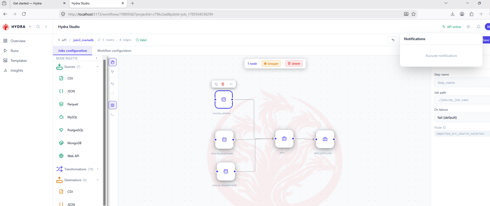
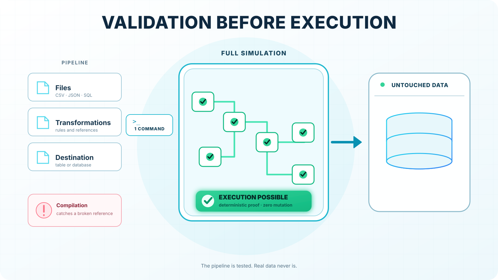
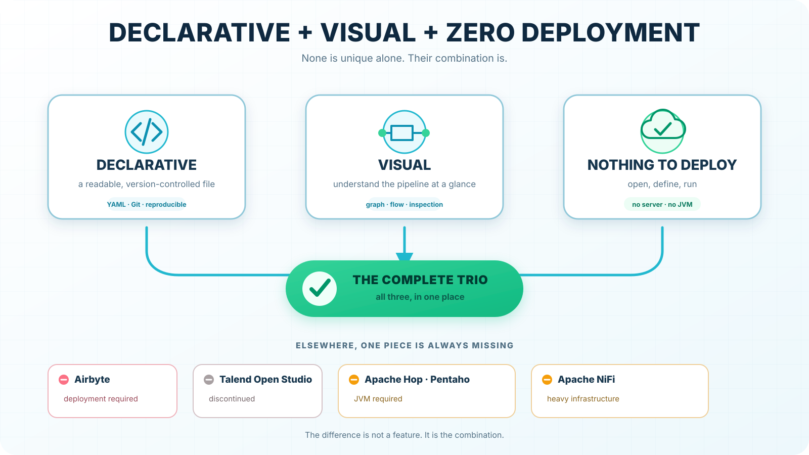
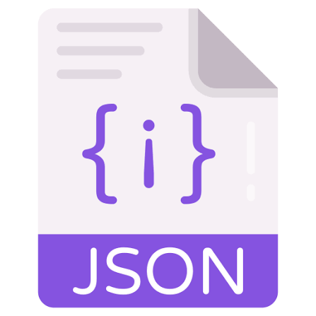
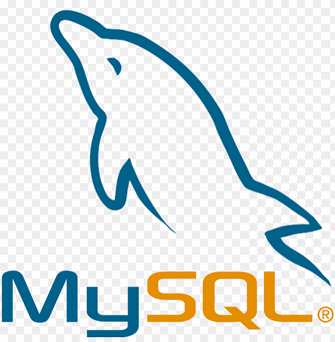
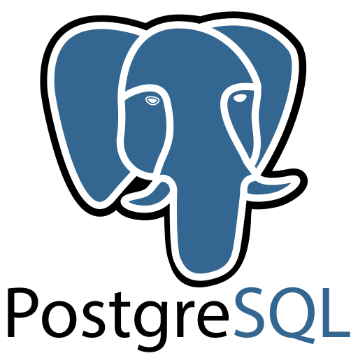
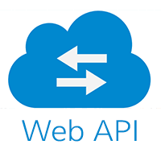
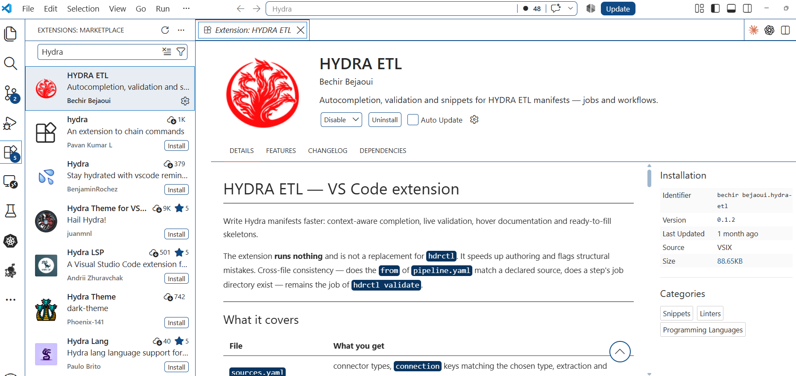

# Hydra ETL

**Your data pipelines are described, not programmed.**

[](https://pypi.org/project/hydra-etl/)
[](https://pypi.org/project/hydra-etl/)
[](LICENSE)
[](#project-status)

**[Website](https://hydraetl.com)** · **[Docs & playground](https://hydraetl.com)** · **[MCP server](docs/MCP.md)** · **[VS Code extension](#vs-code-extension)** · **[Changelog](CHANGELOG.md)**

Hydra is an open-source declarative ETL engine. You write what a pipeline *is* in YAML;
Hydra validates it before touching any data, then runs it. The same manifests run from
the terminal, a REST API, or a visual editor in your browser, with one `pip install` and nothing else to deploy.

<!-- TODO: replace with a short GIF: build a job in Studio → hdrctl validate → hdrctl run -->


---

## Quick start

```bash
pip install "hydra-etl[server]"
hdrctl serve --open            # Studio + API on http://localhost:5678
```

Or stay in the terminal:

```bash
hdrctl init my_job             # scaffold one of six templates
hdrctl validate my_job         # strict validation, no data touched
hdrctl run my_job              # execute
```

No Node, no build step, no database, no message broker. Python 3.9+ on Linux, macOS or Windows.

---

## Why Hydra

- **Validate before you run.** `hdrctl validate` checks sources, steps, types and destinations
  deterministically, before any data is read or written.
- **Declarative, visual, zero deployment.** YAML manifests, a browser editor that outputs the same YAML,
  and a single Python process. No cluster, no JVM, no container required.
- **Built for CI/CD.** Manifests are versioned and reviewed like code; `hdrctl` scaffolds, validates,
  tests and runs from a terminal or a CI job.
- **Built-in scheduler.** DAG workflows with dependencies, parallel branches, delayed retries, cron triggers,
  conditional guards and eleven actions (webhook, email, Bash, PowerShell, SSH, Python…).
- **One job, many environments.** `{{ param: }}`, `{{ env: }}` and `${SECRET:}` keep the manifest identical
  across dev, staging and production.
- **Two engines per operation.** pandas or DuckDB, chosen step by step, with optional Rust acceleration
  (see [Native acceleration](#native-acceleration-optional)).
- **AI-ready.** An MCP server lets Claude, Cursor or VS Code write pipelines that Hydra validates.

<p>
  
  
</p>

### How it compares

|                          | Hydra                     | Airflow                        | dbt                        | Airbyte                  | NiFi / Apache Hop |
| ------------------------ | ------------------------- | ------------------------------ | -------------------------- | ------------------------ | ----------------- |
| Pipelines defined in     | YAML                      | Python                         | SQL + YAML                 | UI / config              | UI flows          |
| Scope                    | Extract, transform, load  | Orchestration                  | Transform in the warehouse | Extract & load           | Extract, transform, load |
| Visual editor            | Included                  | Monitoring UI                  | Not in dbt Core            | Included                 | Included          |
| To get started           | `pip install`             | Scheduler, webserver, metadata DB | A data warehouse        | Docker / Kubernetes      | JVM               |

Hydra is not a replacement for all of these. It targets file-and-database pipelines that should stay
readable and run without extra infrastructure.

---

## What you get

| Component     | Description                                                              |
| ------------- | ------------------------------------------------------------------------ |
| **Engine**    | Declarative jobs: one source, N transformations, one destination         |
| **CLI**       | `hdrctl`: scaffold, validate, run, inspect. English and Spanish          |
| **API**       | FastAPI, with interactive docs at `/docs`                                |
| **Studio**    | Visual editor for jobs and workflows, served by the same process         |
| **Workflows** | Multi-job DAG with dependencies, actions, retries and runtime parameters |
| **MCP**       | Natural-language pipeline authoring, validated by Hydra                  |

**Connectors** (sources and destinations):

| <br>CSV | <br>JSON | <br>Parquet | <br>MySQL / MariaDB | <br>PostgreSQL | <br>MongoDB | <br>Web API |
| :-: | :-: | :-: | :-: | :-: | :-: | :-: |

**Transformation engines:** pandas and DuckDB.

---

## Who it is for

- **Data engineers and analysts** who need repeatable file-and-database pipelines without standing up
  infrastructure for them.
- **Teams where pipelines must stay readable** by people who do not write Python: a YAML manifest
  reviewed in a pull request, not a script.
- **Developers embedding ETL in a product**, who want a CLI and a REST API over the same engine.

---

## A job in four files

A job is a folder. Four manifests describe it, and each one answers a single question.

**`sources.yaml`**: where the data comes from

```yaml
version: "1.0"
sources:
  src_input:
    type: csv
    extract:
      table: ./input.csv
```

**`transformations.yaml`**: how it is reshaped

```yaml
version: "1.0"
steps:
  - cast:
      mapping:
        amount: float
  - filter:
      expr: "amount > 0"
  - aggregate:
      by: [name]
      agg:
        total: { func: sum, col: amount }
```

A CSV carries no types, so `cast` comes before any numeric comparison.

**`destinations.yaml`**: where it goes

```yaml
version: "1.0"
destinations:
  dest_output:
    type: csv
    load:
      table: ./output.csv
      mode: replace          # append | replace | upsert
```

**`pipeline.yaml`**: which source feeds which destination

```yaml
version: "1.0"
pipeline:
  from: src_input
  to: dest_output
```

```bash
hdrctl validate my_job && hdrctl run my_job
```

---

## Workflows: order several jobs

```yaml
version: "1.0"
workflow:
  name: daily_etl
  trigger:
    type: schedule
    cron: "0 8 * * *"
  steps:
    - name: extract
      type: job
      job: ./jobs/extract
      depends_on: []

    - name: transform
      type: job
      job: ./jobs/transform
      depends_on: ["extract"]     # always a list, supports fan-in

    - name: notify
      type: action
      action: webhook
      params: { url: "{{ env:WEBHOOK_URL }}" }
      depends_on: ["transform"]
      on_failure: skip
```

```bash
hdrctl workflow validate ./workflow.yaml
hdrctl workflow run      ./workflow.yaml
```

An edge is a **dependency**, not a pipe: it decides *when* a job runs, never what data reaches it.
Steps that share no dependency run in parallel.


---

## Parameters

Values can be declared once and reused, or created while the workflow runs.

```yaml
- filter:
    expr: "region == '{{ param:region }}'"
```

`{{ param:NAME }}` reads a parameter, `{{ env:NAME }}` an environment variable, `${SECRET:NAME}` a secret.
The `set_param` and `assign_param` actions create and change parameters mid-run, so two jobs can share a
placeholder and produce different results.

---

## Install what you need

The base install is the engine and the CLI. Everything else is opt-in.

```bash
pip install hydra-etl                  # engine + CLI
pip install "hydra-etl[server]"        # + API + Studio
pip install "hydra-etl[postgres]"      # + PostgreSQL driver
pip install "hydra-etl[all]"           # everything
```

Available extras: `server`, `native`, `duckdb`, `parquet`, `mysql`, `postgres`, `mongodb`, `http`, `mcp`, `all`.

---

## Serving

```bash
hdrctl serve                 # Studio and API on port 5678
hdrctl serve --open          # and open the browser
hdrctl serve --no-studio     # API only, for a headless server
hdrctl serve --port 8080
```

The server writes projects into the directory you launch it from. Interactive API docs are at `/docs`.

---

## Your AI assistant, connected (MCP)

Hydra ships an MCP server. Point Claude Desktop, Cursor, VS Code or any MCP client at it, and ask for a
pipeline in plain language.

```bash
pip install "hydra-etl[mcp]"
hydra-mcp
```

Your assistant writes the manifests; **Hydra validates them before anything is written**, and nothing runs
until you ask. See [docs/MCP.md](docs/MCP.md) for client configuration.

---

## Native acceleration (optional)

Parts of the engine have a Rust implementation. It is optional and off by default: without it, Hydra
behaves exactly the same.

```bash
pip install "hydra-etl[native]"
HYDRA_BACKEND=rust hdrctl run ./jobs/sales
```

Or per operation, with a `hydra.backends.yaml` file next to the job:

```yaml
default: python
overrides:
  csv.read: rust      # currently the only accelerated operation
```

On one million rows, CSV reading is about four times faster, with byte-for-byte identical results
(parity checked on 26,000 CSV files and one million floats against CPython `repr()`). Hydra falls back to
Python automatically whenever that guarantee cannot be kept. Benchmarks: [`bench/`](bench/).

---

## VS Code extension

Completion and validation for Hydra manifests inside the editor, without installing Hydra.
Install the latest `.vsix` from [`VS Code Extension/`](VS%20Code%20Extension/).



---

## Project status

**Beta.** The documented connectors and steps are implemented and covered by tests. The shape of the YAML
DSL is settled; any breaking change will be announced in the release notes before 1.0.
Use it on real work, and pin your version.

---

## Contributing

Issues, ideas and pull requests are welcome. See [CONTRIBUTING.md](CONTRIBUTING.md).
If Hydra is useful to you, a ⭐ on GitHub helps others find it.

---

## License

Hydra ETL is released under the **GNU Affero General Public License v3 or later**. See [LICENSE](LICENSE).

You may use, modify and redistribute it freely, including commercially. If you modify Hydra and let others
use it, even only over a network, you must make your modified source available under the same terms.

**Commercial license:** for use without that obligation, contact the author via
[hydraetl.com](https://hydraetl.com) or by opening an issue.
